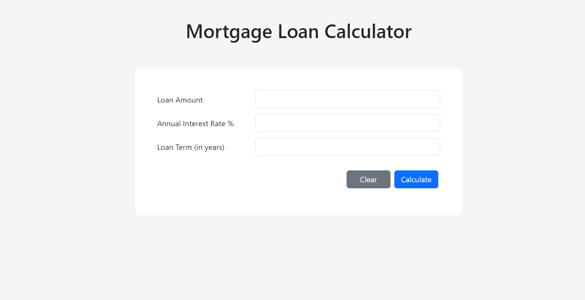
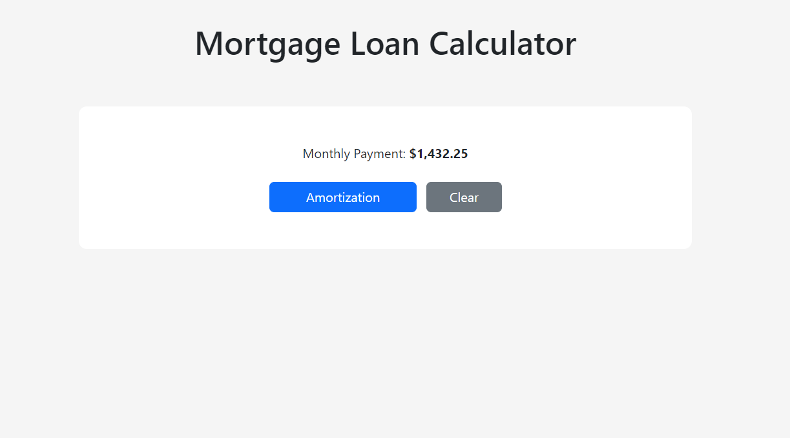
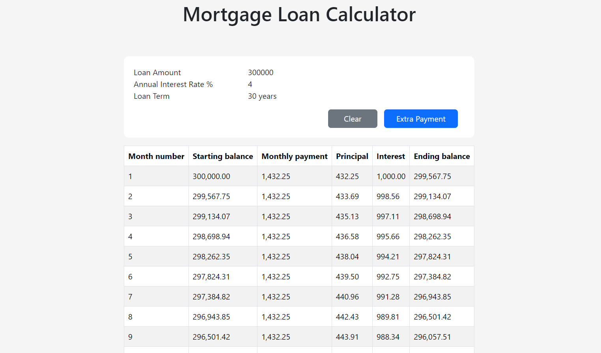
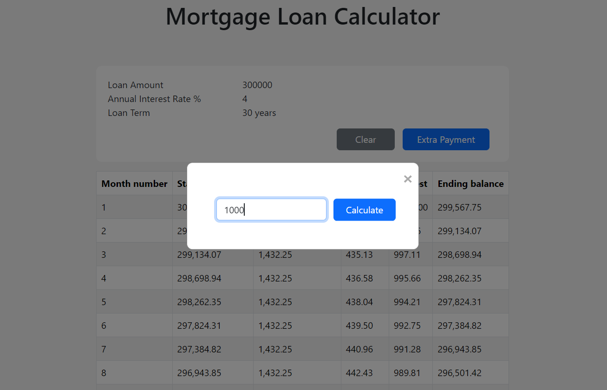

# Mortgage Loan Calculator

This app was developed under the purpose to help you :

- calculate your monthly payment giving : loan total amout, annual intrest rate and loan term.
- generate amortization schedule table to show the principal and intrest component, along side the starting and ending balance.
- enter fixed repayment and recalculate the amortization.

In order to run this app you must have PHP v8, Laravel v10 and postgresql database installed on your machine.

After you done cloning the repository make sure to run `php artisan migrate` inside the project folder.

To start the server run `php artisan serve` and you can then access the app from your browser on the url : *http://127.0.0.1:8000/*

You would first see the home page for the app :

Start entering the informations showed and when done click calculate. Click clear when you want to reset the form.

The next page you will see is the monthly payment result :

You can generate the amortization schedule by clicking on Amortization button :

This last poge show you the amortization schedule along side a header for loan information.

You can add extra payment by clicking on Extra Payment button, where you would see a dialog asking to enter the amount, then click Calculate button :

Next you will see the updated amortization schedule.
